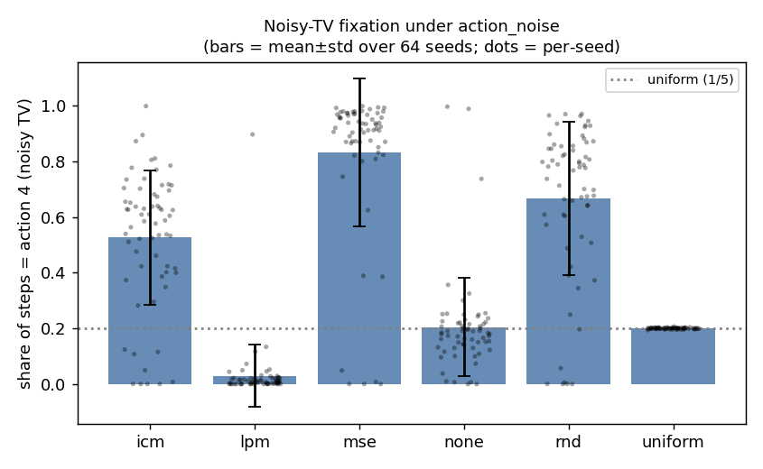
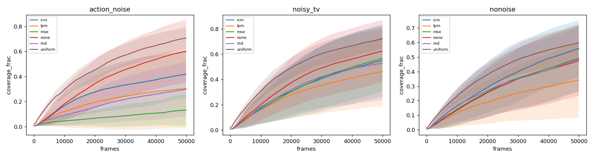
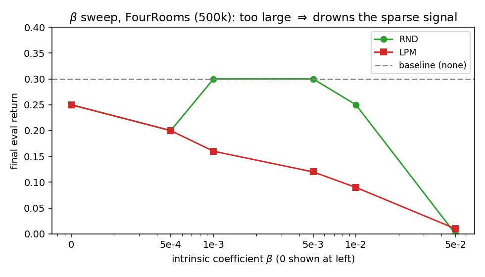
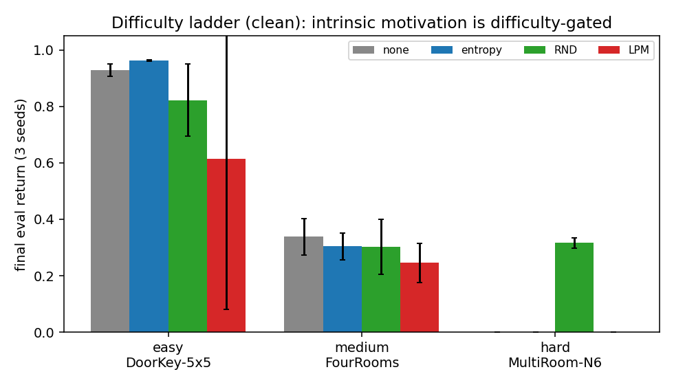
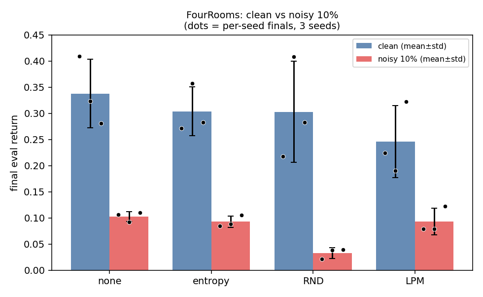
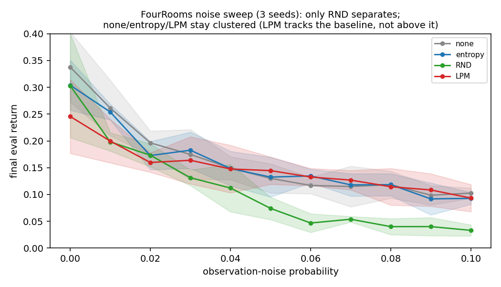

# Noise-Robust Intrinsic Motivation for Exploration

## Reproducing Learning Progress Monitoring and extending it to sparse-reward MiniGrid

**Course:** Challenging Problems in Reinforcement Learning, Lab Course SS 2026  
**Institution:** AI & Formal Methods, Ruhr University Bochum  
**Topic:** Exploration vs. Exploitation  
**Team:** Yingte — experiment design, execution, and data; Youssef — analysis and report  
**Report date:** 8 July 2026

---

## Abstract

Reinforcement-learning agents must explore enough to discover useful behaviour while exploiting what they have learned well enough to solve the task. Intrinsic rewards can guide exploration when external rewards are sparse, but prediction-error methods are vulnerable to stochastic observations: an agent may repeatedly seek an unpredictable yet useless source of noise, the “noisy-TV” problem. This project reproduces and extends Learning Progress Monitoring (LPM), proposed by Hou, An, and Du as a noise-robust alternative that rewards improvement in a learned dynamics model rather than raw prediction error.

The project has three experimental stages. First, a Noisy-MNIST toy experiment qualitatively reproduces the motivating mechanism: prediction error remains high on stochastic transitions, whereas LPM favors learnable transitions. Second, a paper-faithful MiniWorld reproduction compares LPM, RND, ICM, MSE curiosity, an intrinsic-free policy, and uniform random exploration across three noise variants, using 64 seeds and 50,000 steps per run. LPM reproduces the central noise-robustness claim: under action-conditioned noise, MSE spends 83% of its actions on the noise source while LPM spends only 3%. However, a uniform-random policy achieves the highest spatial coverage, showing that coverage in this extrinsic-free maze rewards undirected movement rather than useful exploration.

We therefore extend the study to sparse-reward MiniGrid, where exploration can be judged by task return. PPO is evaluated with no bonus, an entropy bonus, Random Network Distillation (RND), and LPM on an easy-to-hard ladder: DoorKey-5x5, FourRooms, and MultiRoom-N6. Intrinsic motivation is difficulty-gated: it is unnecessary on easy and medium tasks, but RND is decisive on clean MultiRoom-N6, scoring 0.316 while the baseline, entropy, and LPM score 0. Under observation noise, the ordering reverses. RND becomes unstable or collapses, while LPM tracks the robust PPO baseline. The resulting picture is a trade-off: RND provides aggressive novelty-seeking that can solve hard clean exploration, while LPM sacrifices some of that drive to avoid being captured by unlearnable noise.

## 1. Introduction

Exploration vs. exploitation is one of the central problems in reinforcement learning. An exploiting agent repeatedly chooses actions that currently appear best. This can be efficient in a well-understood environment, but it can also trap learning in a suboptimal policy. An exploring agent deliberately gathers new information, but indiscriminate exploration can waste samples, destabilize training, or expose the agent to unnecessary risk.

The problem becomes especially severe under sparse rewards. If the environment gives no useful feedback until a long sequence of actions reaches a goal, the agent has little basis for distinguishing promising behaviour from aimless movement. Classical methods such as ε-greedy action selection, Upper Confidence Bound, Thompson sampling, and Boltzmann exploration address this problem in bandits or small tabular settings. Deep reinforcement learning often needs state-dependent signals that remain useful in large observation spaces. Intrinsic motivation supplies such a signal by rewarding novelty, surprise, information gain, or learning progress.

This report studies a central weakness of curiosity based on prediction error. A stochastic observation can remain unpredictable forever even when it provides no task-relevant information. A curiosity-driven policy may therefore become attracted to noise rather than exploring the rest of the environment. Hou, An, and Du call this the noisy-TV problem and propose Learning Progress Monitoring: reward the reduction of prediction error, not the error itself.

Our project asks both whether this robustness claim reproduces and what it costs. The work begins with the paper’s toy and maze settings, identifies a limitation of spatial coverage as the maze metric, and then moves to sparse-reward MiniGrid. That extension lets us evaluate exploration by whether it helps solve a task, rather than by whether the agent simply visits many cells.

## 2. Motivation and project contribution

The project is motivated by four gaps.

1. **Noise can masquerade as novelty.** A prediction-error bonus stays high on inherently unpredictable observations, even after the agent has learned everything useful about them.
2. **Exploration metrics can be misleading.** Spatial coverage sounds reasonable, but in a small reward-free maze it may rank a random walk above every learned policy.
3. **Intrinsic rewards can overwhelm the task.** Training uses `r_total = r_ext + β · r_int,norm`. If β is too small, the intrinsic signal is irrelevant; if it is too large, the policy optimizes novelty instead of the external goal.
4. **Robustness may trade off against exploration strength.** Suppressing unlearnable novelty could also weaken the positive drive needed to leave familiar states.

The project makes the following empirical contributions:

- a paper-faithful 64-seed MiniWorld reproduction, including a uniform-random control absent from the paper comparison;
- evidence that LPM’s noisy-TV robustness reproduces even though its claimed coverage ranking does not;
- a sparse-reward MiniGrid benchmark spanning easy, medium, and hard exploration;
- a β sweep that identifies the under-exploration, useful, and reward-drowning regimes;
- a corrected, in-range, cell-level observation-noise model;
- quantitative results supplemented by complete trajectory GIFs at untrained, intermediate, and final checkpoints.

## 3. Background

### 3.1 Reinforcement learning

At time `t`, an agent observes `o_t`, selects action `a_t` according to policy `π`, receives reward `r_t`, and transitions to a new state. The objective is to maximize discounted return:

`G_t = sum_{k=0}^{∞} γ^k · r_{t+k+1}`

where γ controls how strongly future rewards matter. In a sparse-reward task, most `r_t` values are zero. Standard policy optimization can therefore receive almost no learning signal until exploration accidentally discovers the goal.

### 3.2 Classical and deep-RL exploration

Classical methods directly randomize or add uncertainty to action selection. ε-greedy chooses a random action with probability ε; UCB adds an uncertainty bonus to poorly sampled actions; Thompson sampling acts according to a sampled posterior; and Boltzmann exploration samples from a temperature-scaled action-value distribution.

Deep-RL methods often construct richer signals from observations or learned representations. Examples include pseudo-counts, ICM, RND, NoisyNets, ensembles, and information-gain objectives. These methods are not merely alternative implementations of ε-greedy: they attempt to direct the policy toward states that are novel or informative.

### 3.3 Intrinsic reward

Intrinsic motivation augments the external task reward:

`r_total,t = r_ext,t + β · r_int,t`

In this project the intrinsic signal is normalized before mixing. The coefficient β is therefore the main control over the exploration–exploitation balance. It does not have a universally optimal value because the external reward scale, episode length, environment difficulty, and intrinsic-reward distribution all vary by task.

### 3.4 Random Network Distillation

RND uses a fixed random target network and trains a predictor to match it. Its intrinsic reward is the prediction error:

`r_RND(o_t) = ||f_predictor(o_t) - f_target(o_t)||²`

Novel observations produce large errors and therefore positive rewards. As observations become familiar, the predictor improves and their reward falls. This creates a strong, always-nonnegative novelty drive. The weakness is that stochastic observations can remain difficult to predict indefinitely.

### 3.5 Learning Progress Monitoring

LPM trains a dynamics model and a second model that estimates the dynamics model’s log prediction error. In the paper-faithful implementation used here, the intrinsic reward is:

`r_LPM(s_t, a_t) = g_ϕ(s_t, a_t) - log(MSE_t)`

The reward measures whether the actual error is lower than expected. A learnable transition can yield positive reward as the dynamics model improves. Inherently unpredictable noise should not: its error remains high and the model makes no sustained progress. Unlike RND, LPM’s reward is signed and can average near zero. This is central to both its robustness and its weaker exploration pressure in our hardest clean task.

### 3.6 The noisy-TV problem

The noisy-TV thought experiment places an unpredictable visual source in the environment. Prediction-error curiosity assigns it persistent value, so the agent repeatedly returns even though the observation does not help solve the task. A useful robust method should distinguish epistemic uncertainty, which learning can reduce, from irreducible stochasticity, which it cannot.

## 4. Research questions

The project addresses four research questions.

- **RQ1:** What do the LPM-paper experiments reveal about suitable exploration metrics?
- **RQ2:** How should extrinsic and intrinsic rewards be mixed, and what happens when β is too small or too large?
- **RQ3:** Do intrinsic-reward methods outperform baseline exploration on sparse-reward MiniGrid tasks?
- **RQ4:** Does LPM’s noise robustness generalize beyond the paper’s MiniWorld noisy-TV setting?

## 5. Experimental programme

### 5.2 Stage II: MiniWorld reproduction

The MiniWorld experiment uses the paper’s hand-designed four-room 3D maze and first-person `160 × 120` RGB observations. There is no external reward. Three variants are evaluated:

- `nonoise`: clean observations;
- `noisy_tv`: a wall displays random RGB noise;
- `action_noise`: a dedicated fifth action replaces the observation with a random CIFAR-10 image.

The agent is trained with A2C for 50,000 steps. We compare LPM, RND, ICM, raw next-frame MSE curiosity, no intrinsic reward, and a uniform-random policy. Each method–variant combination uses 64 seeds. LPM follows the paper’s log-space equations, buffer gating, update cadence, and error-model learning rate.

The metrics are spatial coverage, the fraction of actions spent selecting the action-conditioned noise source, and occupancy heatmaps over training.

### 5.3 Stage III: sparse-reward MiniGrid extension

The MiniGrid study replaces reward-free coverage with sparse task return. All environments regenerate their layouts on every episode, so evaluation measures expected performance over a layout distribution rather than memorization of one maze.

| Difficulty | Environment | Main exploration challenge | Budget | Seeds | Theoretical-max return |
|---|---|---|---:|---:|---:|
| Easy | DoorKey-5x5 | Find key, open door, reach goal | 1M PPO steps | 8 | 0.965 |
| Medium | FourRooms | Navigate random start–goal placements | 1M PPO steps | 3 | 0.856 |
| Hard | MultiRoom-N6 | Traverse a freshly generated six-room chain | 2M PPO steps | 3 | 0.652 |

The agent uses PPO with an MLP policy, eight parallel environments, γ = 0.99, GAE λ = 0.95, rollout length 512 per environment, batch size 64, and learning rate `2.5e-4`. Its observation is the flattened `7 × 7 × 3` egocentric symbolic image, giving 147 inputs. Evaluation is deterministic, uses only external reward, and averages ten freshly generated episodes at each checkpoint.

Four exploration methods are compared:

- `none`: PPO with no entropy or intrinsic bonus;
- `entropy`: PPO with entropy coefficient 0.01;
- `rnd`: PPO with normalized RND reward;
- `lpm`: PPO with paper-faithful normalized LPM reward.

The noisy variants independently corrupt each of the 49 observed cells with probability 0.1. A corrupted cell’s object, color, and state channels are jointly redrawn within their valid MiniGrid ranges. This corrected model produces plausible but false symbolic objects. It is global observation noise, not a localized noisy-TV wall, so it can impair both the exploration signal and the policy’s perception.

## 6. Results

### 6.1 MiniWorld: the noisy-TV robustness claim reproduces

Under `action_noise`, raw MSE curiosity is captured by the distractor. It selects the noise action for 83.0% of its steps. RND and ICM are also affected. LPM selects it only 3.0% of the time, below the 20% chance rate of the uniform policy.

| Policy | TV-action share, mean ± std |
|---|---:|
| LPM | **0.030 ± 0.113** |
| Uniform random | 0.200 ± 0.003 |
| None | 0.205 ± 0.175 |
| ICM | 0.526 ± 0.242 |
| RND | 0.666 ± 0.276 |
| MSE | **0.830 ± 0.266** |

The result supports the mechanism proposed by Hou, An, and Du. Prediction error treats unpredictable images as perpetually interesting. Learning progress does not reward a source on which the dynamics model cannot improve.

### 6.2 MiniWorld: coverage does not rank useful exploration

The paper’s stronger claim that LPM achieves the best maze coverage does not reproduce. The uniform-random control covers the largest fraction of the maze in every variant.

| Policy | Clean | Noisy TV | Action noise |
|---|---:|---:|---:|
| Uniform random | **0.587** | **0.710** | **0.696** |
| None | 0.459 | 0.611 | 0.589 |
| LPM | 0.332 | 0.452 | 0.299 |
| MSE | 0.476 | 0.551 | 0.129 |
| ICM | 0.542 | 0.536 | 0.410 |
| RND | 0.468 | 0.519 | 0.290 |

This is not evidence that random exploration is generally superior. It shows that the metric is misaligned with the intended capability in this particular reward-free maze. A random walk spreads broadly; a learned policy often settles into a narrower route. Noise avoidance and coverage are also decoupled: uniform random wastes 20% of its actions on noise and still covers the most, while LPM largely ignores the distractor but covers less. This result motivates the move to sparse task reward in MiniGrid.

### 6.3 MiniGrid: β has a narrow, environment-dependent useful range

The FourRooms sweep shows three regimes. With β near zero, intrinsic reward changes little. Around `0.001–0.005`, RND can match the baseline. At β = 0.05, both RND and LPM collapse to approximately zero return because cumulative intrinsic reward becomes roughly `100–700 ×` the sparse external reward.

| Method | β = 0 | 0.0005 | 0.001 | 0.005 | 0.01 | 0.05 |
|---|---:|---:|---:|---:|---:|---:|
| RND | 0.25 | 0.20 | 0.30 | 0.30 | 0.25 | **0.00** |
| LPM | 0.25 | 0.20 | 0.16 | 0.12 | 0.09 | **0.01** |

The hard task adds an important qualification. RND solves MultiRoom-N6 only at β = 0.005. At 0.01 and 0.05 it sometimes reaches the goal during stochastic training but fails to consolidate a reliable deterministic policy. The coefficient therefore controls both discovery and eventual exploitation; “more intrinsic reward” is not monotonically better.

### 6.4 MiniGrid: intrinsic motivation is difficulty-gated

On clean DoorKey-5x5 and FourRooms, PPO already explores adequately. Intrinsic reward offers no average improvement and often slightly hurts. On MultiRoom-N6, the baseline and entropy agent never reach the goal, while RND reaches a final evaluation return of 0.316 ± 0.018.

| Clean environment | None | Entropy | RND | LPM |
|---|---:|---:|---:|---:|
| DoorKey-5x5 | **0.941** | 0.914 | 0.866 | 0.669 |
| FourRooms | **0.338** | 0.304 | 0.303 | 0.246 |
| MultiRoom-N6 | 0.000 | 0.000 | **0.316** | 0.000 |

This result answers an important methodological question: intrinsic motivation should not be expected to improve every environment. Its value emerges when exploration is the bottleneck. In easy tasks it adds a competing objective; in the hard MultiRoom chain, RND’s always-positive novelty reward supplies the drive that PPO and entropy alone lack.

LPM does not solve MultiRoom-N6 at any tested β in `{0.005, 0.01, 0.05}`. Its episode-level reward is signed and nearly cancels: at β = 0.005, mean intrinsic return is approximately +0.08 while mean absolute intrinsic return is approximately 0.33. Increasing β scales the oscillation but does not create a consistent direction. This reveals the cost side of noise robustness: a signal designed to vanish for unlearnable noise may also provide too little pressure after local dynamics become familiar.

### 6.5 MiniGrid: noise reverses the RND–LPM comparison

The corrected 10%-of-cells noise model preserves a clear qualitative result.

| Environment | Method | Clean mean ± std | Noisy mean ± std |
|---|---|---:|---:|
| DoorKey-5x5 | None | 0.941 ± 0.02 | 0.961 ± 0.001 |
| DoorKey-5x5 | Entropy | 0.914 ± 0.04 | 0.961 ± 0.001 |
| DoorKey-5x5 | RND | 0.866 ± 0.09 | **0.516 ± 0.40** |
| DoorKey-5x5 | LPM | 0.669 ± 0.42 | **0.961 ± 0.001** |
| FourRooms | None | 0.338 ± 0.07 | 0.103 ± 0.010 |
| FourRooms | Entropy | 0.304 ± 0.05 | 0.093 ± 0.011 |
| FourRooms | RND | 0.303 ± 0.10 | **0.033 ± 0.010** |
| FourRooms | LPM | 0.246 ± 0.07 | 0.093 ± 0.025 |
| MultiRoom-N6 | None | 0.000 | 0.000 |
| MultiRoom-N6 | Entropy | 0.000 | 0.000 |
| MultiRoom-N6 | RND | 0.316 ± 0.02 | 0.000 |
| MultiRoom-N6 | LPM | 0.000 | 0.000 |

DoorKey-5x5 provides the cleanest separation because perception remains good enough for the plain policy to solve the task. Under noise, none, entropy, and LPM all score approximately 0.96. RND alone becomes unstable, with per-seed returns spanning approximately 0.03 to 0.96. On FourRooms, global corruption hurts every method, but RND falls furthest and becomes the worst. A fine sweep from noise probability 0 to 0.1 confirms that RND separates below the pack from approximately 0.04 onward, while none, entropy, and LPM remain statistically tied. On MultiRoom-N6, the task is difficult enough that global noise breaks all methods.

The careful conclusion is therefore not that LPM beats a plain robust baseline. Rather, LPM avoids RND’s noise-chasing failure and tracks the baseline. In this MiniGrid setting, its advantage is **noise neutrality relative to RND**, not a return improvement over PPO without intrinsic reward.

### 6.6 Qualitative trajectory evidence

The trajectory gallery shows a top-down trail on the left and the agent’s actual egocentric symbolic observation on the right. In noisy runs, magenta outlines mark cells whose object channel was altered. Each configuration includes untrained, intermediate, final, and combined three-stage GIFs.

The following episodes illustrate the two headline behaviours. They are selected trajectories, not substitutes for the multi-seed statistics above.

| Hard clean exploration | Observation-noise robustness |
|---|---|
|  |  |
| RND traverses the six-room chain and reaches the goal. [Training-stage strip](../expr_data/minigrid/gifs/multiroom-n6_clean_rnd/strip.gif) | LPM reaches the goal despite corrupted observations. [Training-stage strip](../expr_data/minigrid/gifs/fourrooms_noisy_lpm/strip.gif) |

| Matching failure case | Matching failure case |
|---|---|
|  |  |
| Plain PPO fails to progress through the hard room chain. [Training-stage strip](../expr_data/minigrid/gifs/multiroom-n6_clean_none/strip.gif) | RND fails on the selected noisy FourRooms layout. [Training-stage strip](../expr_data/minigrid/gifs/fourrooms_noisy_rnd/strip.gif) |

The [complete trajectory gallery](../expr_data/minigrid/gifs/README.md) contains all 24 combinations: three environments, clean and noisy observations, and four exploration methods.

## 7. Answers to the research questions

### RQ1: What is a suitable exploration metric?

Coverage is useful only when broad visitation is aligned with the downstream goal. In the extrinsic-free MiniWorld maze it rewards uniform randomness and fails to distinguish useful directed exploration. Direct noisy-TV fixation is appropriate for robustness, while sparse task return and sample-efficiency curves are better measures of whether exploration helps solve a task. No single metric is sufficient: this project combines return, training curves, fixation, per-seed distributions, and trajectories.

### RQ2: How should intrinsic and extrinsic rewards be mixed?

The correct scale is environment-dependent. A very small β is effectively ignored. A moderate value can enable discovery, with RND performing best near β = 0.005 on the hard task. A large β makes novelty dominate external reward and can prevent convergence even after the goal is discovered. Intrinsic and extrinsic episode returns should therefore be logged separately, and β should be calibrated against both their magnitudes and final external-only evaluation.

### RQ3: Do intrinsic methods outperform the baselines?

Only when exploration is genuinely difficult. They do not improve DoorKey-5x5 or FourRooms, where PPO already receives enough successful experience. On clean MultiRoom-N6, RND decisively outperforms both plain PPO and entropy exploration. LPM does not, because its signed learning-progress reward provides insufficient directional drive in this task.

### RQ4: Does LPM generalize beyond the MiniWorld noisy TV?

Yes, in the specific sense predicted by its mechanism. Under symbolic MiniGrid observation corruption, LPM avoids RND’s collapse and behaves like the robust baseline. DoorKey isolates this effect; FourRooms confirms the ordering under a fine noise sweep. LPM is not universally superior, however: it under-explores clean MultiRoom-N6 and does not beat plain PPO under noise.

## 8. Discussion

The experiments expose a meaningful three-way relationship among novelty, learning progress, and task reward.

RND is an effective explorer because its reward is positive wherever the predictor remains inaccurate. That pressure can pull the policy through a long sequence of unfamiliar rooms before any external success. The same mechanism is fragile under stochastic input: corrupted observations continue to look new, so the intrinsic objective can compete with the task.

LPM asks a more conservative question: is the model improving here? This removes incentive for irreducible noise. The conservative signal can also disappear in familiar local regions before the policy has reached a distant task state. Our results therefore suggest that LPM and RND occupy different points on the exploration–robustness frontier rather than one strictly dominating the other.

The baseline results are equally important. When PPO already solves an easy task, adding intrinsic reward is unnecessary and may reduce performance. Under observation noise, plain PPO is naturally robust to the noisy-TV incentive failure because it has no novelty objective to hijack. A fair claim for LPM must therefore compare it separately against prediction-error curiosity and against a no-intrinsic baseline.

The project also demonstrates the importance of negative results and controls. Adding uniform random exploration changed the interpretation of MiniWorld coverage. Replacing memory-dependent KeyCorridor with MultiRoom-N6 prevented an architectural limitation from being misreported as an exploration failure. Correcting the observation-noise wrapper changed the magnitude but not the ordering of the noise result. Finally, increasing DoorKey to eight seeds revealed true bimodality in LPM’s clean performance rather than merely shrinking uncertainty.

## 9. Limitations and threats to validity

- **Seed count:** DoorKey uses eight seeds, but most MiniGrid comparisons use three. Large effects are visible, but small method differences should not be over-interpreted.
- **Global noise:** MiniGrid corruption affects the policy’s perception everywhere. It is harsher and less localized than a physical noisy-TV distractor, especially in FourRooms and MultiRoom-N6.
- **Single policy architecture:** The MiniGrid agent is feed-forward. Memory-dependent KeyCorridor was unsolvable for every method because the observation omits carried-key state; a recurrent policy is needed for that question.
- **β search:** The sweep identifies useful regimes but is not an exhaustive per-environment optimization. Comparisons reflect the tested settings.
- **LPM stability:** Clean DoorKey LPM is bimodal: six of eight seeds produce successful or strongly positive policies, while two collapse to zero; most successful seeds are near the task ceiling. Its `0.669 ± 0.42` mean is therefore not a smooth performance distribution.
- **Trajectory selection:** GIFs show one training seed and one layout seed per configuration. They explain behaviour visually but do not establish frequency or expected performance.
- **Procedural layouts:** Returns average across regenerated layouts. This improves generalization validity but makes any single rendered episode less representative, particularly in FourRooms.
- **Scope:** The Atari and Montezuma’s Revenge pipelines were not exercised. Their required 50–200 million-frame budgets are outside the available CPU-only scope.
- **Metric dependence:** MiniWorld has no task reward, so its coverage result and the MiniGrid return result answer related but not identical questions.

## 10. Reproducibility

### 10.1 Code and provenance

- Official LPM snapshot: [`LPM_exploration/`](../LPM_exploration/), pinned to commit `a295e3452491d9475c485a1a66a029eac4d0b55d`.
- Local deviations from upstream: [`LPM_exploration/UPSTREAM.md`](../LPM_exploration/UPSTREAM.md).
- MiniWorld comparison harness: [`LPM_exploration/Miniworld/experiments/`](../LPM_exploration/Miniworld/experiments/).
- MiniGrid implementation: [`minigrid_exp/`](../minigrid_exp/).
- Full experimental log: [`expr_data/minigrid/FINDINGS.md`](../expr_data/minigrid/FINDINGS.md).
- Detailed analysis source: [`latex_notes/2026-06-18-minigrid-intrinsic-exploration.tex`](../latex_notes/2026-06-18-minigrid-intrinsic-exploration.tex).

### 10.2 Data organization

All large artifacts are stored under `expr_data/` and excluded from Git. MiniWorld results, positions, and figures live under `expr_data/miniworld/`. MiniGrid checkpoints, monitor logs, evaluation archives, figures, and GIFs live under `expr_data/minigrid/`. The GIF metadata table records the training seed, selected layout seed, and final episode return for each visualization.

### 10.3 Evaluation conventions

- MiniWorld results use 64 independent seeds and the paper’s 50,000-step budget.
- MiniGrid final return is external reward only, from deterministic evaluation.
- Each MiniGrid evaluation episode receives a freshly randomized layout.
- Means and standard deviations are computed over seeds; per-seed dots are retained in the main plots.
- Long MiniGrid runs use checkpoint-and-resume chunks because the compute host terminates long-lived CPU processes after approximately 18 minutes.

## 11. Conclusion

This project reproduces the core insight behind Learning Progress Monitoring: rewarding model improvement avoids the noisy-TV trap that captures prediction-error curiosity. The MiniWorld reproduction makes that result direct—LPM almost never selects the noise source while MSE spends most of its time there. It also reveals that coverage is not automatically a valid exploration metric: in the reward-free maze, uniform random movement covers more than every learned policy.

The MiniGrid extension provides the missing task-oriented evaluation. RND demonstrates why intrinsic motivation matters by solving clean MultiRoom-N6 when plain PPO and entropy never reach the goal. LPM demonstrates the complementary virtue of conservatism by remaining stable under observation noise when RND becomes unreliable. Neither method dominates. RND buys hard-exploration ability at the price of noise fragility; LPM gives up some exploration pressure to avoid that fragility. Across both methods, β determines whether intrinsic reward is ignored, useful, or destructive.

The most defensible overall conclusion is therefore conditional: use intrinsic motivation when exploration is truly the bottleneck, evaluate it with task-aligned metrics and no-intrinsic controls, tune its scale against external return, and test whether its novelty signal can distinguish learnable uncertainty from irreducible noise.

## 12. Future work

1. Add a localized noisy-TV object to MiniGrid so observation noise does not globally damage perception.
2. Evaluate hybrid rewards that combine RND’s positive novelty drive with an LPM-style learnability gate.
3. Run recurrent PPO on KeyCorridor to separate exploration difficulty from memory requirements.
4. Increase the seed count for FourRooms and MultiRoom-N6, especially around β = 0.005.
5. Compare adaptive β schedules that reduce intrinsic weight after the first task successes.
6. Add risk-sensitive metrics to connect exploration efficiency with the course’s safety question.
7. Use downscaled Atari smoke tests only for implementation validation; a faithful performance study requires GPU-scale compute.

## References

1. Hou, X., An, B., and Du, Y. (2026). [Beyond Noisy-TVs: Noise-Robust Exploration via Learning Progress Monitoring](https://arxiv.org/abs/2509.25438). ICLR 2026.
2. Aubret, A., Matignon, L., and Hassas, S. (2019). [A Survey on Intrinsic Motivation in Reinforcement Learning](https://arxiv.org/abs/1908.06976).
3. Burda, Y., Edwards, H., Storkey, A., and Klimov, O. (2019). [Exploration by Random Network Distillation](https://arxiv.org/abs/1810.12894). ICLR 2019.
4. Pathak, D., Agrawal, P., Efros, A. A., and Darrell, T. (2017). [Curiosity-driven Exploration by Self-supervised Prediction](https://arxiv.org/abs/1705.05363). ICML 2017.
5. Schulman, J., Wolski, F., Dhariwal, P., Radford, A., and Klimov, O. (2017). [Proximal Policy Optimization Algorithms](https://arxiv.org/abs/1707.06347).
6. Sutton, R. S., and Barto, A. G. (2018). [Reinforcement Learning: An Introduction, second edition](http://incompleteideas.net/book/the-book-2nd.html). MIT Press.
7. Farama Foundation. [MiniGrid: Minimalistic Gridworld Environments](https://github.com/Farama-Foundation/Minigrid).

---

## Appendix A. MiniGrid trajectory gallery index

Each link opens the combined untrained → intermediate → final trajectory strip.

| Environment | Condition | None | Entropy | RND | LPM |
|---|---|---|---|---|---|
| DoorKey-5x5 | Clean | [strip](../expr_data/minigrid/gifs/doorkey-5x5_clean_none/strip.gif) | [strip](../expr_data/minigrid/gifs/doorkey-5x5_clean_entropy/strip.gif) | [strip](../expr_data/minigrid/gifs/doorkey-5x5_clean_rnd/strip.gif) | [strip](../expr_data/minigrid/gifs/doorkey-5x5_clean_lpm/strip.gif) |
| DoorKey-5x5 | Noisy | [strip](../expr_data/minigrid/gifs/doorkey-5x5_noisy_none/strip.gif) | [strip](../expr_data/minigrid/gifs/doorkey-5x5_noisy_entropy/strip.gif) | [strip](../expr_data/minigrid/gifs/doorkey-5x5_noisy_rnd/strip.gif) | [strip](../expr_data/minigrid/gifs/doorkey-5x5_noisy_lpm/strip.gif) |
| FourRooms | Clean | [strip](../expr_data/minigrid/gifs/fourrooms_clean_none/strip.gif) | [strip](../expr_data/minigrid/gifs/fourrooms_clean_entropy/strip.gif) | [strip](../expr_data/minigrid/gifs/fourrooms_clean_rnd/strip.gif) | [strip](../expr_data/minigrid/gifs/fourrooms_clean_lpm/strip.gif) |
| FourRooms | Noisy | [strip](../expr_data/minigrid/gifs/fourrooms_noisy_none/strip.gif) | [strip](../expr_data/minigrid/gifs/fourrooms_noisy_entropy/strip.gif) | [strip](../expr_data/minigrid/gifs/fourrooms_noisy_rnd/strip.gif) | [strip](../expr_data/minigrid/gifs/fourrooms_noisy_lpm/strip.gif) |
| MultiRoom-N6 | Clean | [strip](../expr_data/minigrid/gifs/multiroom-n6_clean_none/strip.gif) | [strip](../expr_data/minigrid/gifs/multiroom-n6_clean_entropy/strip.gif) | [strip](../expr_data/minigrid/gifs/multiroom-n6_clean_rnd/strip.gif) | [strip](../expr_data/minigrid/gifs/multiroom-n6_clean_lpm/strip.gif) |
| MultiRoom-N6 | Noisy | [strip](../expr_data/minigrid/gifs/multiroom-n6_noisy_none/strip.gif) | [strip](../expr_data/minigrid/gifs/multiroom-n6_noisy_entropy/strip.gif) | [strip](../expr_data/minigrid/gifs/multiroom-n6_noisy_rnd/strip.gif) | [strip](../expr_data/minigrid/gifs/multiroom-n6_noisy_lpm/strip.gif) |

## Appendix B. Project status

| Component | Status | Role in the report |
|---|---|---|
| Noisy-MNIST | Complete | Mechanism sanity check |
| MiniWorld reproduction | Complete | Paper-faithful robustness and metric study |
| Sparse-reward MiniGrid | Complete | Main project extension |
| Ms Pac-Man | Harness exists; not exercised | Outside completed empirical claims |
| Montezuma’s Revenge | Not exercised | Outside available compute budget |
